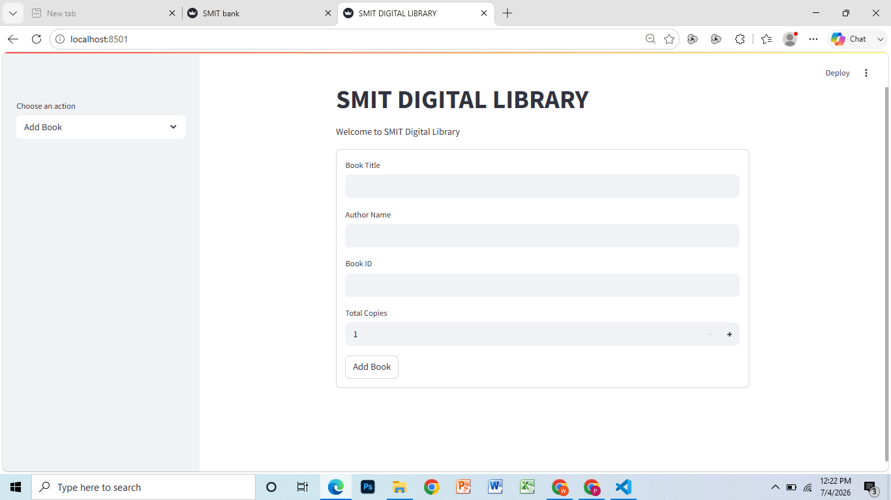
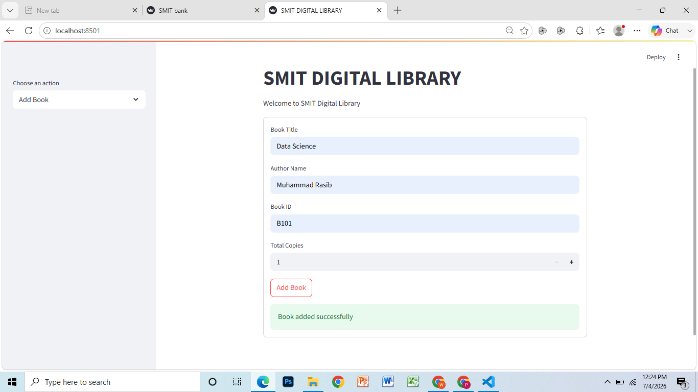
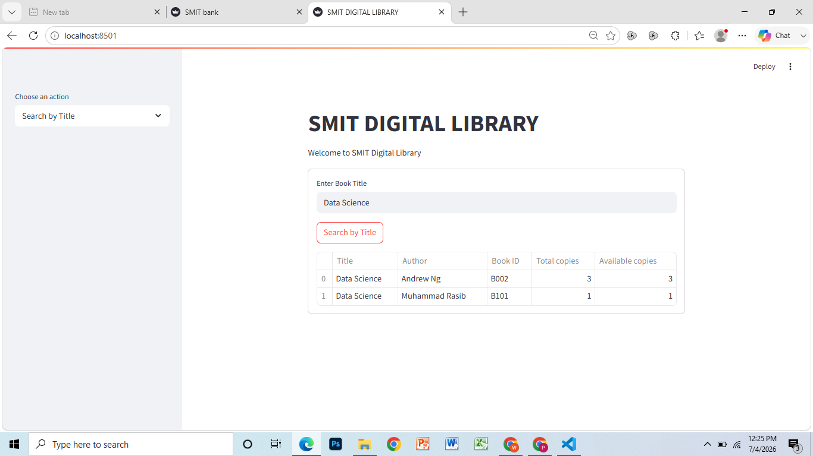
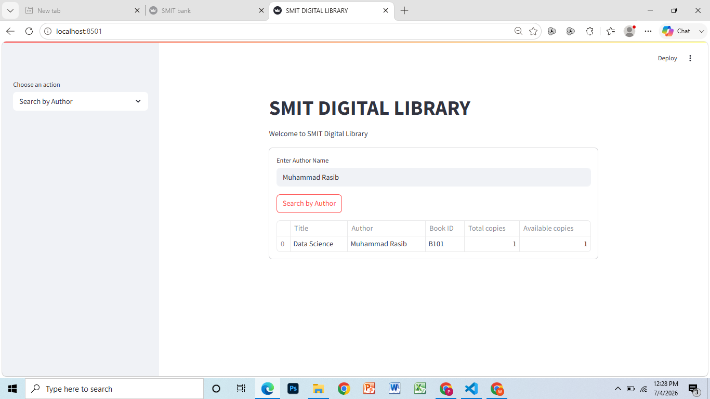
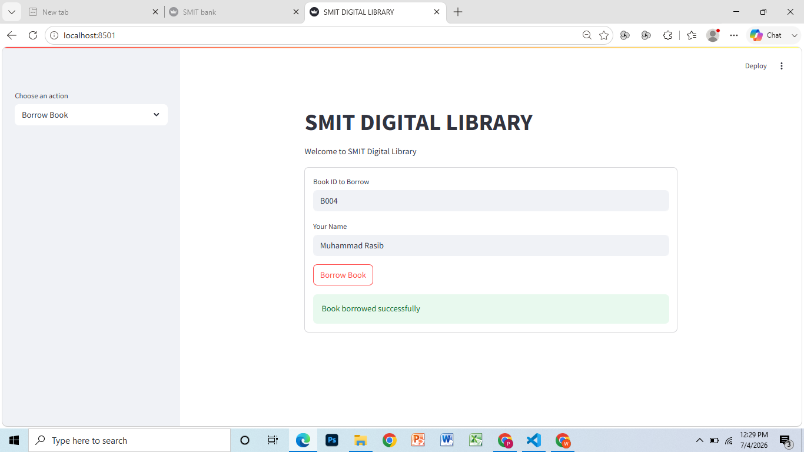
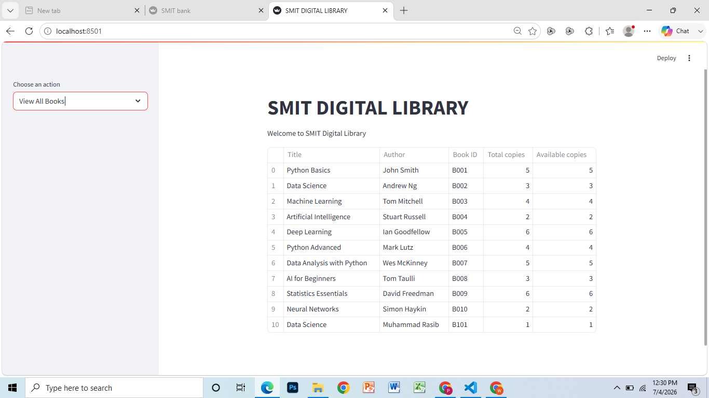
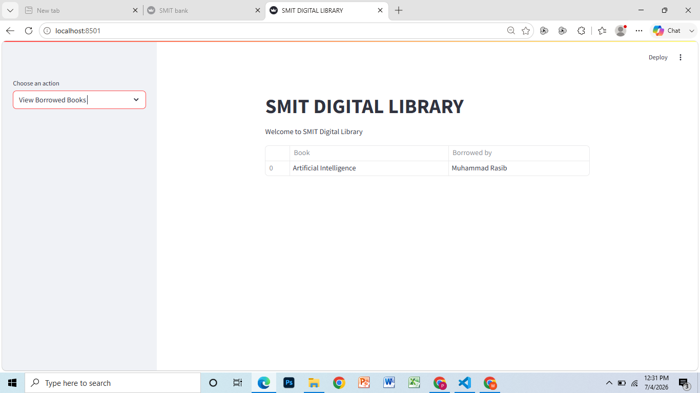

# 📚 Digital Library Management System

## 🌐 Live Demo

🚀 **Try the Live Application:**

[](https://digital-library-management-system-mgmvbyjcnu48ouf5h4dapo.streamlit.app/)

👉 **Live URL:** https://digital-library-management-system-mgmvbyjcnu48ouf5h4dapo.streamlit.app/

---

A simple and interactive **Digital Library Management System** built using **Python**, **Object-Oriented Programming (OOP)**, and **Streamlit**. This application allows users to manage library operations such as adding books, searching books, borrowing books, returning books, and viewing library records through an intuitive web interface.

---

## 📖 Project Overview

The **Digital Library Management System** is a beginner-friendly project developed to demonstrate the practical implementation of **Object-Oriented Programming (OOP)** concepts using Python.

The application utilizes classes, objects, encapsulation, dictionaries, and Streamlit's session state to simulate a digital library system without relying on a database. It provides an interactive interface for performing common library management tasks efficiently.

---

## ✨ Features

* ➕ Add new books to the library
* 🔍 Search books by title
* 👤 Search books by author
* 📚 Borrow available books
* 🔄 Return borrowed books
* 📋 View all books in the library
* 📖 View borrowed books
* 🖥️ Interactive Streamlit-based user interface
* 🧩 Implementation of Object-Oriented Programming (OOP)

---

## 🛠️ Technologies Used

* Python
* Streamlit
* Object-Oriented Programming (OOP)
* Git
* GitHub

---

## 📂 Project Structure

```text
Digital-Library-Management-System
│
├── digital_library.py
├── Screenshots
│   ├── Home_Page.png
│   ├── Add_Book.png
│   ├── Search_By_Title.png
│   ├── Search_By_Author.png
│   ├── Borrow_Book.png
│   ├── Return_Book.png
│   ├── View_All_Books.png
│   └── View_Borrowed_Books.png
├── .gitignore
├── LICENSE
├── README.md
└── requirements.txt
```

---

## 🚀 Installation

### 1. Clone the Repository

```bash
git clone https://github.com/rasib-ai-dev/Digital-Library-Management-System.git
```

### 2. Navigate to the Project Directory

```bash
cd Digital-Library-Management-System
```

### 3. Install the Required Dependency

```bash
pip install -r requirements.txt
```

### 4. Run the Application

```bash
streamlit run digital_library.py
```

---

## 📷 Application Screenshots

### 🏠 Home Page



---

### ➕ Add Book



---

### 🔍 Search by Title



---

### 👤 Search by Author



---

### 📚 Borrow Book



---

### 🔄 Return Book


---

### 📋 View All Books



---

### 📖 View Borrowed Books



---

## 🚀 Future Improvements

* Store library data using a database (SQLite or MySQL)
* Add user authentication
* Implement book categories
* Add due dates and fine calculation
* Enhance the user interface

---

## 📄 License

This project is licensed under the **MIT License**. See the **LICENSE** file for more details.

---

## 👨‍💻 Author

**Muhammad Rasib**

GitHub: **https://github.com/rasib-ai-dev**

---

## ⭐ Support

If you found this project helpful, please consider giving it a **Star ⭐** on GitHub.
